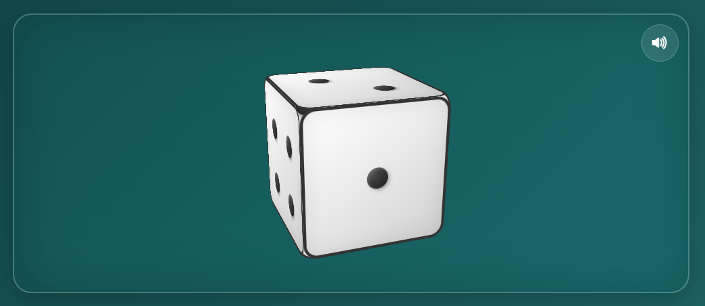
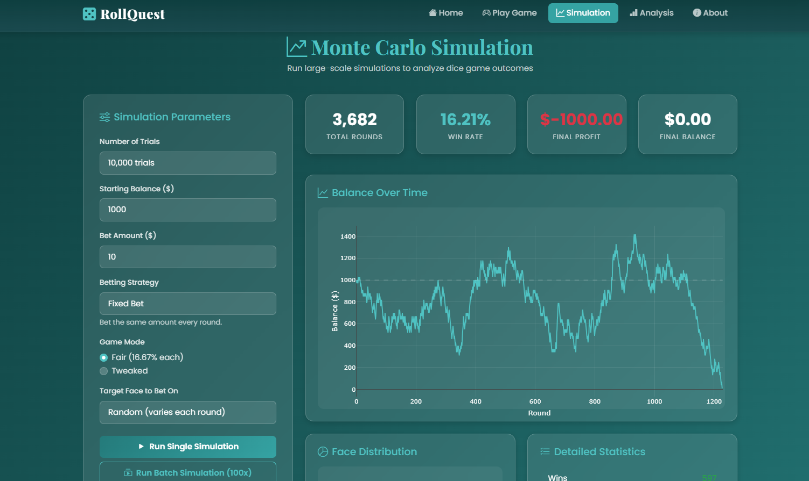
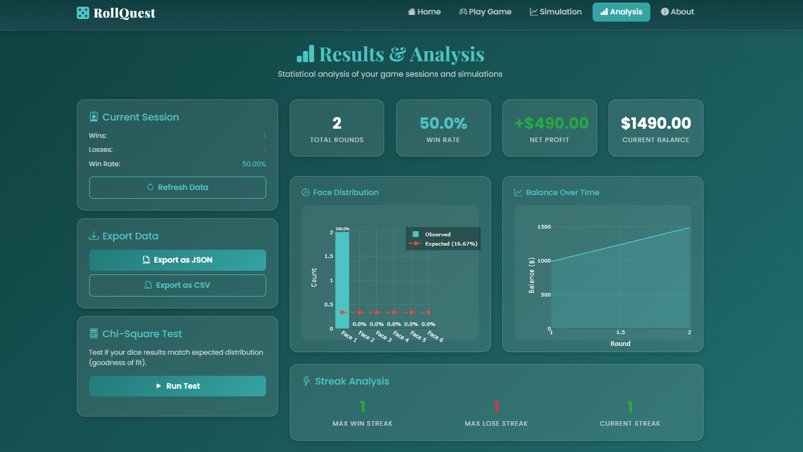
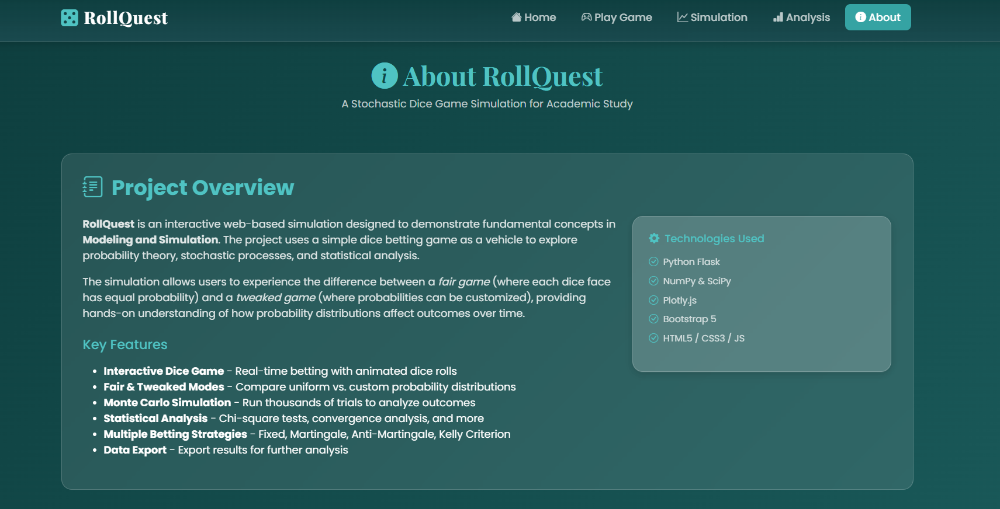

<p align="center">
  
</p>

<!-- <h1 align="center">RollQuest</h1> -->

<p align="center">
  <strong>A Stochastic Dice Game Simulation for Probability & Monte Carlo Analysis</strong>
</p>

<p align="center">
  <a href="https://rollquest.games">Live Demo</a> •
  <a href="#features">Features</a> •
  <a href="#installation">Installation</a> •
  <a href="#usage">Usage</a> •
  <a href="#documentation">Documentation</a>
</p>

<p align="center">
  
  
  
  
  
</p>

---

## Table of Contents

- [Overview](#overview)
- [Features](#features)
- [Screenshots](#screenshots)
- [Tech Stack](#tech-stack)
- [Installation](#installation)
- [Usage](#usage)
- [Project Structure](#project-structure)
- [Game Mechanics](#game-mechanics)
- [API Reference](#api-reference)
- [Betting Strategies](#betting-strategies)
- [Statistical Methods](#statistical-methods)
- [Team](#team)
- [License](#license)

---

## Overview

**RollQuest** is an interactive web-based simulation platform designed to demonstrate fundamental concepts in **Probability Theory**, **Stochastic Processes**, and **Monte Carlo Simulation**. Developed as an academic project for **CSEC 413: Modeling and Simulation**, this application uses a dice betting game as an engaging vehicle to explore statistical analysis and the Law of Large Numbers.

### Educational Objectives

| Objective | Description |
|-----------|-------------|
| **Probability Distributions** | Compare fair (uniform) vs. custom (tweaked) probability distributions |
| **Law of Large Numbers** | Observe convergence of sample means to expected values over many trials |
| **Monte Carlo Methods** | Run large-scale simulations to estimate probabilities and outcomes |
| **Statistical Testing** | Apply Chi-square goodness-of-fit tests to validate randomness |
| **Betting Strategy Analysis** | Evaluate different betting systems mathematically |

---

## Features

### Interactive Dice Game
- **3D Animated Dice** with realistic rolling physics and sound effects
- **Real-time Statistics** tracking wins, losses, and profit
- **Dual Game Modes**: Fair (equal probability) and Tweaked (custom probability)
- **Adjustable Bet Amounts** with intuitive controls

### Monte Carlo Simulation Engine
- Run up to **1,000,000 trials** per simulation
- Support for **4 betting strategies**: Fixed, Martingale, Anti-Martingale, Kelly Criterion
- **Batch simulations** (100 runs) for statistical reliability
- **Convergence analysis** with visual probability convergence charts

### Statistical Analysis Dashboard
- **Chi-square Tests** for fairness validation
- **Face Distribution Charts** comparing observed vs. expected frequencies
- **Profit Over Time** visualization
- **Comparative Analysis** between fair and tweaked game modes
- **Data Export** to CSV for external analysis

### Modern UI/UX
- Responsive design with **Bootstrap 5**
- Beautiful **teal gradient theme**
- **Plotly.js** interactive charts
- **Web Audio API** procedural sound effects

---

## Screenshots

### Home Page
The landing page features an elegant hero section with floating dice animations and a call-to-action button.

<!-- PLACEHOLDER: Add screenshot of home page -->
<!-- Suggested filename: docs/images/screenshot-home.png -->
<!-- Capture: Full home page with hero section and floating dice -->
<p align="center">
  
  <br>
  <em>RollQuest Home Page - Welcome screen with animated background</em>
</p>

---

### Game Page
The main game interface with 3D dice, betting controls, and real-time statistics panel.

<!-- PLACEHOLDER: Add screenshot of game page -->
<!-- Suggested filename: docs/images/screenshot-game.png -->
<!-- Capture: Game page showing dice, bet controls, and stats panel -->
<p align="center">
  
  <br>
  <em>Interactive Dice Game - Place bets and roll the 3D animated dice</em>
</p>

---

### 3D Dice Animation
Close-up of the 3D CSS dice with smooth 60fps rotation animation.

<!-- PLACEHOLDER: Add screenshot/GIF of dice rolling -->
<!-- Suggested filename: docs/images/screenshot-dice-roll.gif -->
<!-- Capture: GIF of dice rolling animation (use screen recorder) -->
<p align="center">
  
  <br>
  <em>3D Dice with realistic rolling animation and sound effects</em>
</p>

---

### Monte Carlo Simulation
Configure simulation parameters and run thousands of trials to analyze outcomes.

<!-- PLACEHOLDER: Add screenshot of simulation page with results -->
<!-- Suggested filename: docs/images/screenshot-simulation.png -->
<!-- Capture: Simulation page showing parameters panel and result charts -->
<p align="center">
  
  <br>
  <em>Monte Carlo Simulation - Run up to 1 million trials with various betting strategies</em>
</p>

---

### Simulation Results
Detailed results showing win rate, profit distribution, and convergence analysis.

<!-- PLACEHOLDER: Add screenshot of simulation results -->
<!-- Suggested filename: docs/images/screenshot-simulation-results.png -->
<!-- Capture: Results panel with charts after running simulation -->
<p align="center">
  
  <br>
  <em>Simulation Results - Win rate convergence and profit distribution charts</em>
</p>

---

### Statistical Analysis
Comprehensive analysis dashboard with Chi-square tests and distribution comparisons.

<!-- PLACEHOLDER: Add screenshot of analysis page -->
<!-- Suggested filename: docs/images/screenshot-analysis.png -->
<!-- Capture: Analysis page with Chi-square test results and face distribution chart -->
<p align="center">
  
  <br>
  <em>Statistical Analysis - Chi-square tests and face distribution comparison</em>
</p>

---

### Face Distribution Chart
Bar chart comparing observed frequencies against expected theoretical values.

<!-- PLACEHOLDER: Add screenshot of face distribution chart -->
<!-- Suggested filename: docs/images/screenshot-distribution.png -->
<!-- Capture: Close-up of the Plotly face distribution bar chart -->
<p align="center">
  
  <br>
  <em>Face Distribution Analysis - Observed vs Expected frequencies</em>
</p>

---

### About Page
Project information, theoretical background, and team member profiles.

<!-- PLACEHOLDER: Add screenshot of about page -->
<!-- Suggested filename: docs/images/screenshot-about.png -->
<!-- Capture: About page showing project overview and team section -->
<p align="center">
  
  <br>
  <em>About Page - Project documentation and team profiles</em>
</p>

---

## Tech Stack

### Backend
| Technology | Purpose | Version |
|------------|---------|---------|
| **Python** | Core programming language | 3.10+ |
| **Flask** | Web framework | 2.3+ |
| **NumPy** | Numerical computations | 1.24+ |
| **SciPy** | Statistical functions (Chi-square) | 1.10+ |
| **Pandas** | Data manipulation | 2.0+ |
| **Gunicorn** | Production WSGI server | 21.0+ |

### Frontend
| Technology | Purpose |
|------------|---------|
| **HTML5 / CSS3** | Structure and styling |
| **JavaScript (ES6+)** | Client-side interactivity |
| **Bootstrap 5** | Responsive UI framework |
| **Plotly.js** | Interactive data visualization |
| **Bootstrap Icons** | Icon library |
| **Web Audio API** | Procedural sound generation |

### DevOps & Hosting
| Technology | Purpose |
|------------|---------|
| **Git / GitHub** | Version control |
| **Render** | Cloud hosting platform |
| **name.com** | Domain management |

---

## Installation

### Prerequisites
- Python 3.10 or higher
- pip (Python package manager)
- Git

### Step 1: Clone the Repository
```bash
git clone https://github.com/s0y4hh/Roll_Quest.git
cd Roll_Quest
```

### Step 2: Create Virtual Environment
```bash
# Create virtual environment
python -m venv .venv

# Activate virtual environment
# On Linux/macOS:
source .venv/bin/activate

# On Windows:
.venv\Scripts\activate
```

### Step 3: Environment Configuration
```bash
# Copy environment template
cp .env.example .env

# Edit .env file with your settings
nano .env
```

**Required environment variables:**
- `FLASK_ENV`: Set to `development` for local development
- `SECRET_KEY`: Generate a secure random key for production
- `PORT`: Optional, defaults to 5000

### Step 4: Install Dependencies
```bash
pip install -r requirements.txt
```

### Step 4: Run the Application
```bash
python run.py
```

### Step 5: Access the Application
Open your browser and navigate to:
```
http://127.0.0.1:5000
```

---

## Usage

### Playing the Dice Game

1. **Navigate to Game Page** - Click "Start Rolling" or "Game" in navigation
2. **Select Game Mode**:
   - **Fair Mode**: Each face has 16.67% probability
   - **Tweaked Mode**: Customize probabilities using sliders
3. **Place Your Bet**:
   - Choose a face (1-6) to bet on
   - Set your bet amount using +/- buttons or input field
4. **Roll the Dice** - Click the "Roll Dice" button
5. **View Results** - Watch the 3D animation and see if you won!

### Running Monte Carlo Simulations

1. **Navigate to Simulation Page**
2. **Configure Parameters**:
   - Number of trials (100 to 1,000,000)
   - Starting balance
   - Bet amount
   - Betting strategy
   - Game mode (Fair/Tweaked)
   - Target face (optional)
3. **Run Simulation**:
   - **Single Run**: One simulation with specified trials
   - **Batch Run**: 100 simulations for statistical analysis
   - **Convergence Analysis**: Track probability convergence over time
4. **Analyze Results**: View charts and statistics

### Statistical Analysis

1. **Play some games** to generate data
2. **Navigate to Analysis Page**
3. **View Statistics**:
   - Session overview (total rolls, win rate, profit)
   - Chi-square test results
   - Face distribution comparison
   - Profit over time chart
4. **Compare Modes**: Run analysis for both Fair and Tweaked modes
5. **Export Data**: Download results as CSV

---

## Project Structure

```
Roll_Quest/
├── run.py                       # Application entry point
├── requirements.txt             # Python dependencies
├── README.md                    # Project documentation
├── .env.example                 # Environment variables template
├── Procfile                     # Heroku deployment configuration
├── runtime.txt                  # Python version specification
├── test.dat                     # Test data file
│
├── app/                         # Main application package
│   ├── __init__.py              # App factory & configuration
│   ├── config.py                # Configuration settings
│   │
│   ├── models/                  # Data models
│   │   ├── dice.py              # Dice class with probability logic
│   │   └── game_session.py      # Game session management
│   │
│   ├── routes/                  # Blueprint route handlers
│   │   ├── home.py              # Home page routes
│   │   ├── game.py              # Game API endpoints
│   │   ├── simulation.py        # Monte Carlo simulation routes
│   │   ├── analysis.py          # Statistical analysis routes
│   │   └── about.py             # About page routes
│   │
│   ├── services/                # Business logic services
│   │   ├── monte_carlo.py       # Monte Carlo simulation engine
│   │   └── statistics.py        # Statistical analysis functions
│   │
│   ├── static/                  # Static assets
│   │   ├── css/
│   │   │   ├── style.css        # Main stylesheet
│   │   │   └── dice.css         # 3D dice animations
│   │   ├── js/
│   │   │   ├── dice.js          # Dice class & sound manager
│   │   │   ├── game.js          # Game page logic
│   │   │   ├── simulation.js    # Simulation page logic
│   │   │   └── analysis.js      # Analysis page logic
│   │   ├── images/              # Static images
│   │   ├── sounds/              # Audio files (procedural generation)
│   │   ├── robots.txt           # SEO crawler directives
│   │   └── sitemap.xml          # SEO sitemap
│   │
│   └── templates/               # Jinja2 HTML templates
│       ├── base.html            # Base template with SEO
│       ├── home.html            # Home page
│       ├── game.html            # Game page
│       ├── simulation.html      # Simulation page
│       ├── analysis.html        # Analysis page
│       └── about.html           # About page
│
├── flask_session/               # Server-side session storage
│
├── docs/                        # Documentation assets
│   └── images/                  # Screenshots and images
│
├── .venv/                       # Virtual environment (created locally)
└── .git/                        # Git repository data
```

---

## Game Mechanics

### Probability Model

#### Fair Dice (Uniform Distribution)
Each face has equal probability:
```
P(Face = i) = 1/6 ≈ 16.67%  for i ∈ {1, 2, 3, 4, 5, 6}
```

**Expected Value of Dice Roll:**
```
E[X] = Σ(i × P(i)) = (1+2+3+4+5+6)/6 = 3.5
```

**Variance:**
```
Var(X) = E[X²] - (E[X])² = 35/12 ≈ 2.917
```

#### Tweaked Dice (Custom Distribution)
Probabilities can be adjusted, with automatic normalization:
```
P(Face = i) = p_i / Σp_j  where Σp_i = 1
```

### Payout System
- **Win**: Bet amount × 6 (return includes original bet)
- **Loss**: Lose bet amount
- **Expected Value (Fair Game)**: E[Profit] = (1/6 × 6 - 1) × Bet = 0

### Win Probability
For betting on a single face:
- **Fair Game**: 16.67% chance to win
- **Tweaked Game**: Varies based on configured probabilities

---

## API Reference

### Game Endpoints

#### Roll Dice
```http
POST /game/roll
```

**Request Body:**
```json
{
  "bet_amount": 10,
  "chosen_face": 3,
  "game_mode": "fair",
  "probabilities": {
    "1": 16.67, "2": 16.67, "3": 16.67,
    "4": 16.67, "5": 16.67, "6": 16.67
  }
}
```

**Response:**
```json
{
  "result": 3,
  "won": true,
  "payout": 60,
  "balance": 1050,
  "stats": {
    "total_rolls": 15,
    "wins": 3,
    "losses": 12,
    "total_profit": 50
  }
}
```

#### Reset Game
```http
POST /game/reset
```

### Simulation Endpoints

#### Run Simulation
```http
POST /simulation/run
```

**Request Body:**
```json
{
  "num_trials": 10000,
  "starting_balance": 1000,
  "bet_amount": 10,
  "strategy": "fixed",
  "game_mode": "fair",
  "target_face": null,
  "probabilities": {}
}
```

#### Run Batch Simulation
```http
POST /simulation/batch
```

#### Run Convergence Analysis
```http
POST /simulation/convergence
```

### Analysis Endpoints

#### Get Session Statistics
```http
GET /analysis/session-stats
```

#### Run Chi-Square Test
```http
POST /analysis/chi-square
```

#### Export Data
```http
GET /analysis/export
```

---

## Betting Strategies

### 1. Fixed Bet
Bet the same amount every round regardless of outcome.
- **Risk Level**: Low
- **Best For**: Steady, predictable gameplay

### 2. Martingale System
Double the bet after every loss; reset to base bet after win.
- **Risk Level**: High
- **Theory**: Eventually recover all losses with one win
- **Danger**: Exponential bet growth can lead to rapid ruin

### 3. Anti-Martingale System
Double the bet after every win; reset to base bet after loss.
- **Risk Level**: Medium
- **Theory**: Capitalize on winning streaks
- **Advantage**: Limits losses during cold streaks

### 4. Kelly Criterion
Bet a fraction of bankroll based on edge and odds:
```
f* = (bp - q) / b

where:
  f* = fraction of bankroll to bet
  b  = odds received on bet (5 for 6x payout)
  p  = probability of winning
  q  = probability of losing (1 - p)
```
- **Risk Level**: Variable
- **Theory**: Optimal long-term growth rate
- **Note**: Requires positive expected value to be effective

---

## Statistical Methods

### Chi-Square Goodness-of-Fit Test
Tests whether observed dice rolls follow the expected distribution:

```
χ² = Σ (O_i - E_i)² / E_i

where:
  O_i = Observed frequency of face i
  E_i = Expected frequency of face i
  df  = 5 (degrees of freedom for 6 faces)
```

**Interpretation:**
- **p-value > 0.05**: No significant deviation from expected (fair)
- **p-value < 0.05**: Significant deviation detected (potentially biased)

### Law of Large Numbers
As the number of trials increases, the sample mean converges to the expected value:

```
lim(n→∞) (1/n) Σ X_i = E[X]
```

The convergence analysis feature demonstrates this principle by tracking:
- Win rate convergence to theoretical probability
- Average dice value convergence to 3.5

### Variance and Standard Error
```
SE = σ / √n

where:
  σ = Standard deviation
  n = Number of trials
```

---

## Team

<table>
  <tr>
    <td align="center">
      <a href="https://github.com/s0y4hh">
        
        <br />
        <sub><b>s0y4hh</b></sub>
      </a>
      <br />
      <sub>Lead Developer</sub>
    </td>
    <td align="center">
      <a href="https://github.com/niwiisaaa">
        
        <br />
        <sub><b>niwiisaaa</b></sub>
      </a>
      <br />
      <sub>Technical Writer</sub>
    </td>
    <td align="center">
      <a href="https://github.com/hycinthe">
        
        <br />
        <sub><b>hycinthe</b></sub>
      </a>
      <br />
      <sub>Technical Writer</sub>
    </td>
  </tr>
</table>

**Course**: CSEC 413 - Modeling and Simulation  
**Institution**: CAMARINES SUR POLYTECHNIC COLLEGES  
**Academic Year**: 2024-2025

---

## License

This project is licensed under the **MIT License** - see the [LICENSE](LICENSE) file for details.

```
MIT License

Copyright (c) 2025 RollQuest Team

Permission is hereby granted, free of charge, to any person obtaining a copy
of this software and associated documentation files (the "Software"), to deal
in the Software without restriction, including without limitation the rights
to use, copy, modify, merge, publish, distribute, sublicense, and/or sell
copies of the Software, and to permit persons to whom the Software is
furnished to do so, subject to the following conditions:

The above copyright notice and this permission notice shall be included in all
copies or substantial portions of the Software.

THE SOFTWARE IS PROVIDED "AS IS", WITHOUT WARRANTY OF ANY KIND, EXPRESS OR
IMPLIED, INCLUDING BUT NOT LIMITED TO THE WARRANTIES OF MERCHANTABILITY,
FITNESS FOR A PARTICULAR PURPOSE AND NONINFRINGEMENT. IN NO EVENT SHALL THE
AUTHORS OR COPYRIGHT HOLDERS BE LIABLE FOR ANY CLAIM, DAMAGES OR OTHER
LIABILITY, WHETHER IN AN ACTION OF CONTRACT, TORT OR OTHERWISE, ARISING FROM,
OUT OF OR IN CONNECTION WITH THE SOFTWARE OR THE USE OR OTHER DEALINGS IN THE
SOFTWARE.
```

---

## Acknowledgments

- **Flask** - Lightweight WSGI web application framework
- **NumPy** & **SciPy** - Fundamental packages for scientific computing
- **Plotly.js** - Interactive graphing library
- **Bootstrap** - CSS framework for responsive design
- **Bootstrap Icons** - Open source icon library

---

<p align="center">
  Made for CSEC 413 - Modeling and Simulation final project requirement
</p>

<p align="center">
  <a href="https://rollquest.games">Visit RollQuest</a> •
  <a href="https://github.com/s0y4hh/Roll_Quest">Star on GitHub</a>
</p>
